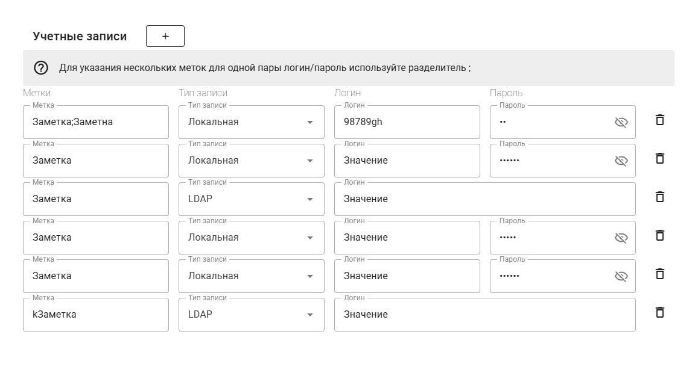

# Тестовое для SaaSoft

форма учетных записей



## Что есть
работа с сущностями учатных записей:
- редактирование
- создание
- удаление

сохранение данных в Pinia и в localStorage (чтобы данные сохранялись при перезагрузке страницы)

а также привлекательная верстка :D

## Особенности
### Поле "Метки"
тип поля - массив строк. чтобы пользователь мог удобно его вводить используется разбиение его ввода с помощью символа ```;```

### Поле "Тип записи"
если значение переключается с "Локального", то нужно скрыть поле Пароля и установить значение пароля в null.

а также нужно расширить поле Логина, чтобы красиво смотрелась форма и не было лишней пустоты. в flexbox для этого удобно использовать flex-grow, но в моем случае я использовал grid сетку, поэтому сработало свойство grid-column для элменета поля логина, чтобы он занимал 2 колонки

### Сохранение в LocalStorage
я добавил кнопку "Сохранить", чтобы сделать запись явной для пользователя. 

в итоге все учетные записи содержатся в таком виде:
```js
[
    {
        "tags": [
            "XXXX",
            "YYYYY",
            "IIIIIIIIIIIII"
        ],
        "recordType": "LDAP",
        "login": "Значение",
        "password": null,
        "id": 1
    },
    {
        "tags": [
            "Значение"
        ],
        "recordType": "local",
        "login": "Значение",
        "password": "Парольfghfg",
        "id": 2
    },
]
```

## Стек
- Vue 3, Composition API
- Pinia
- TypeScript

## Как развернуть
1. скачать проект любым удобным способом
2. перейти в директорию проекта
3. установить зависимости (```npm i```)
4. запустить проект с помощью команды ```npm run dev```

## Послесловие
ну и если я какое-нибудь README до конца дочитываю, то никогда не поленюсь поставить лайк, написать комментарий типа братан хорош давай давай вперед контент в кайф можно еще можно вот этого вот почаще?
